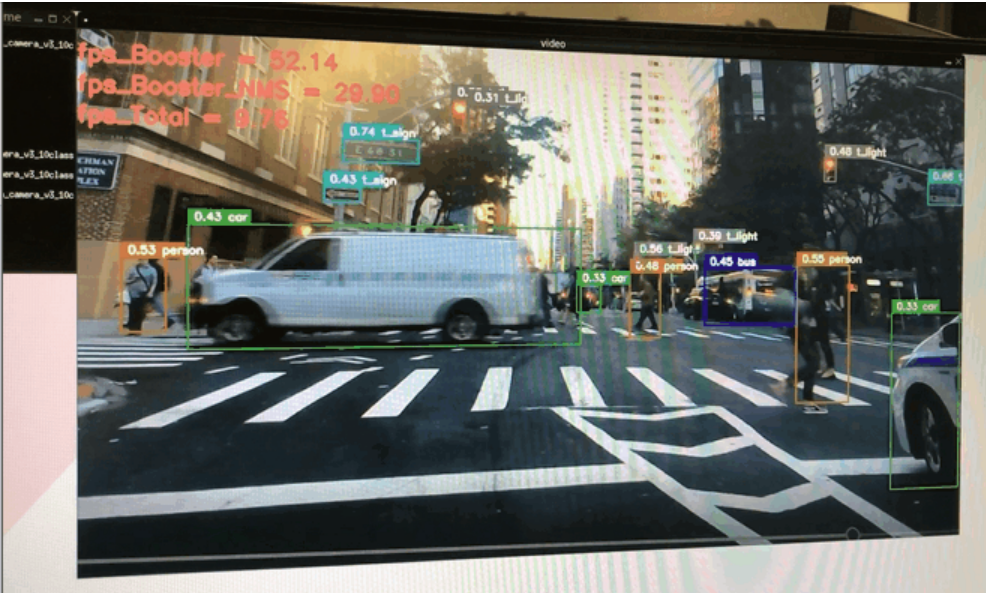

# Booster
A configurable hardware accelerator that supports a variety of vehicle environment perception algorithms based on Xilinx ZYNQ

# Introduction
Self-driving cars cope with high-speed driving scenarios such as highways and trunk roads and the need to make timely responses to various sudden events, such as lane changes of vehicles next to them, sudden failures of vehicles ahead or the sudden appearance of pedestrians ahead, etc. The detection system requires high real-time performance, of which the hardware acceleration platform is the most critical part of the whole system. 

The intelligent acceleration platform called **Booster** designed in this project can reason and accelerate a variety of deep learning algorithms to help the autonomous driving system quickly and comprehensively cognize complex road conditions, accurately perceive and predict traffic conditions during vehicle travel, and make accurate judgments about the surrounding environment in real time. In addition, it can also be applied in embedded fields such as intelligent security, smart transportation, and industrial production.


# System Architecture


The entire system is built on the Xilinx ZYNQ heterogeneous computing platform, with the ARM (CPU) side running a Linux system with the PYNQ software framework, the CPU configuring the accelerator and DMA through the AXI-GP interface, and the accelerator data handling relying on the DMA through the AXI-HP interface, using the AXI-Stream bus. The accelerator system, called Booster System, contains a cache module, a compute module, and a bus interface module.

The cache module contains the instruction cache, the BN parameter cache, the weight cache, and the input and output caches for the image and computation results.

The computation module is the core module of the Booster, which mainly consists of the control module, two feature map cache cache modules, PE module, preprocessing module, accumulation module, BN ReLU module (referred to as BR module), and pooling module.

### Main Features

 + A generalized accelerator architecture, called Booster. It consists of a cache part and a computational part. The cache module is used to configure the parameters of the network model, and the user can directly deploy different CNN network models by configuring the parameters of the network model and instructions describing the model structure to the parameter cache and instruction cache of the accelerator system.

 + High utilization PE unit design, which can realize 3 different types of convolutional computation, including standard convolution, deep convolution, and point convolution
Software and hardware co-design based on quantization-aware training (INT8, W8A8)

- Support operators
  + Standard Convolution、Depthwise Convolution、Pointwise Convolution
  + Max Pooling、Average Pooling
  + ReLU
  + Batch Normalization
  + Concat
  + Upsample
  + Branch
  + Round
  
## Resource

| Resource | Utilization | Available | Utilization / % |
| :------: | :---------: | :-------: | :-------------: |
|   LUT    |    98193    |  230400   |      42.62      |
|  LUTRAM  |    28190    |  101760   |      27.70      |
|    FF    |    72421    |  460800   |      15.72      |
|   BRAM   |     156     |    312    |      50.00      |
|   URAM   |     96      |    96     |     100.00      |
|   DSP    |     625     |   1728    |      36.17      |

## Power


# Demo
- Model：MobileNetV1 YoloV3-tiny
- Image Size：640x320
- Dataset：BDD100k
- mAp after training with 7 classes

| Class  | mAP@0.5:0.95 (fp32) |  mAP@0.5:0.95 (INT8)  |
| :------: | :---------: | :-------: |
|  all   |         0.193         |         0.185         |
| person |         0.153         |         0.147         |
| rider  |        0.0869         |        0.0886         |
|  car   |         0.367         |         0.349         |
|  bus   |         0.274         |         0.259         |
| truck  |         0.268         |         0.251         |
|  bike  |         0.107         |         0.105         |
| motor  |        0.0938         |        0.0949         |

### Scene I: Downtown street scene application

- Model： MobileNetV1-YoloV3-tiny，image size 640x320x3
- Platform：ZCU104 + PYNQ
- Scene building: OpenCV reads Camera, sequentially performs image Resize, Accelerator Inference, NMS processing and Box display.



### Scene II: Highway scene application
- Model： MobileNetV1-YoloV3-tiny，image size 640x320x3
- Platform：ZCU104 + PYNQ
- Scene building: OpenCV reads Video, sequentially performs image Resize, Accelerator Inference, NMS processing and Box display.


# Test
|           Test Work                                 |  FPS  |
|           :------:                                |:------: |
|      Video Read Baseline                            |  67   |
|     Camera Read Baseline                            | 14/90 |
|            Booster                                  |  52   |
|       Booster+NMS(CPU)                              |  33   |
| Video+IMG Resize+Booster+NMS                        |  20   |
| Camera+IMG Resize+Booster+NMS                       | 10/24 |

- Camera1 is logitech's c270 (720p 30fps) , Camera Read Baseline FPS is 14fps
- Camera2 is See3CAM_CU30_CHL_TC_BX (1080p 60fps)，Camera Read Baseline FPS is 90fps
- Booster Frequency is 215MHz，the Bus width of AXI is 32bit

## Things used in this project
- Xilinx Zynq UltraScale+ MPSoC ZCU104
- USB Camera
- DP interface display or active DP-to-HDMI adapter and HDMI display
- Xilinx PYNQ Framwork

## How to use demo work
1. Download demo file to your project work directory, such as

    ```
    git clone https://github.com/SamZhengzb/Booster.git
    ```

2. Prepare a Demo video and make sure the development board is installed USB camera

2. Run demo file with python3, you can see object detection boxes on the display 

    ```bash
    python3 run_camera_v3_10class.py  
    ```
